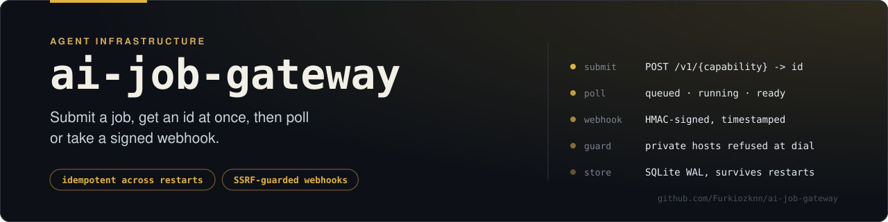
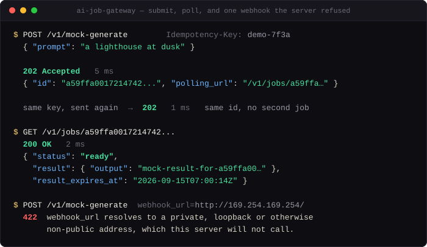
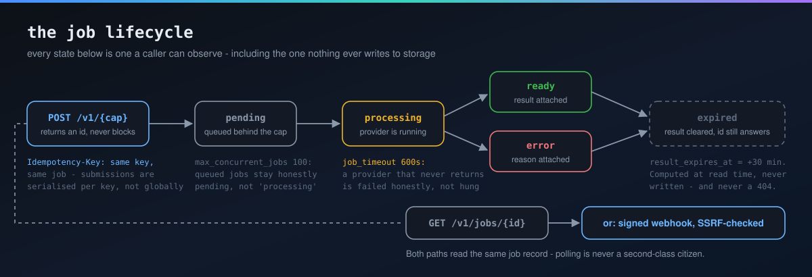
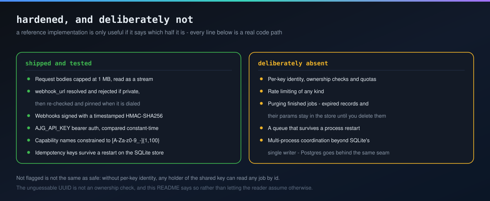

# ai-job-gateway

**Submit a generative-AI job, get an id back instantly, poll or get webhooked when it's done — a small, hardened, provider-agnostic reference server for the async job contract every serious inference API ends up with.**

A provider-agnostic, self-hostable reference implementation of the async job contract independently converged on by [fal.ai](https://fal.ai), [Black Forest Labs' own hosted API](https://bfl.ai), and RunPod's [`worker-comfyui`](https://github.com/runpod-workers/worker-comfyui):

```
POST /v1/{capability}   ->  202 { "id": "...", "polling_url": "/v1/jobs/{id}" }
GET  {polling_url}      ->  { "status": "pending"|"processing"|"ready"|"error"|"expired", "result": {...}?, "error": "..."? }
```

Submit a job, get an id back immediately, poll (or get a webhook) until it's done. That's the whole public contract, for *any* generative model — image, video, lip-sync, whatever a `Provider` wraps.

<p align="center">
  
</p>

<p align="center"><sub><i>A real session against <code>ai-job-gateway serve</code>. The second POST carries the same <code>Idempotency-Key</code> and gets the same id back — no second job. The last one asks the server to call <code>169.254.169.254</code>, and it refuses.</i></sub></p>

## Quick start

Needs Python 3.11+ and [uv](https://docs.astral.sh/uv/). Not on PyPI yet, so install from a clone:

```bash
git clone https://github.com/Furkiozknn/ai-job-gateway
cd ai-job-gateway
uv sync
uv run ai-job-gateway serve            # http://127.0.0.1:8000, interactive docs at /docs
```

In a second terminal, submit a job and wait for its result:

```bash
uv run ai-job-gateway submit echo '{"prompt": "hello"}'
# submitted job 3f2c… -> polling /v1/jobs/3f2c…
# {
#   "echoed": {
#     "prompt": "hello"
#   }
# }
```

`echo` and `mock-generate` run locally with no key and no network. Next: [Running the reference server](#running-the-reference-server) for curl, persistence and webhooks, and [Writing a new Provider](#writing-a-new-provider) to plug in your own model.

This isn't a copy of fal.ai's or RunPod's code — it's an original implementation of the same well-known, provider-independently-discovered API shape, built as a genuinely reusable open-source building block for a small ecosystem of focused AI-creative-platform repos. Elsewhere in that ecosystem, a future image-gen wrapper, video-gen wrapper, or lip-sync wrapper registers itself here as a `Provider` under a capability name, and every one of them gets the same submit/poll/webhook contract, job persistence, and expiry semantics for free.

## Why this contract

BFL's own hosted API and RunPod's `worker-comfyui` reach the same shape independently:

- **Submit returns immediately.** The caller never blocks on GPU time; `POST` hands back a job id and a URL to poll.
- **Result URLs are short-lived.** BFL expires image URLs after 10 minutes — a deliberate cost/storage-lifecycle decision that forces the caller to persist results promptly instead of treating the gateway as permanent storage. This repo makes that a first-class, `GET`-visible `expired` status rather than a silent 404.
- **Webhooks are optional, polling is the fallback.** Some callers want push, most are fine polling every second or two. Both should work off the same job record.

## Architecture



```
┌─────────────┐   submit/poll    ┌──────────────┐   run(job_id, params)   ┌───────────┐
│ Your caller │ ───────────────► │  HTTP API     │ ──────────────────────► │ Provider  │
│ (or the     │ ◄─────────────── │  (FastAPI)    │                         │ (your     │
│  client lib)│   job record     │               │ ◄────────────────────── │  backend) │
└─────────────┘                  └──────┬────────┘   result dict / raise  └───────────┘
                                         │
                                         ▼
                                  ┌──────────────┐
                                  │  JobStore     │  in-memory or SQLite,
                                  │  (+ expiry)   │  same interface either way
                                  └──────────────┘
```

- **`Provider`** — the pluggable seam. One async method: `run(job_id, params) -> dict`, or raise. Everything else in this repo is generic over "some provider."
- **`JobManager`** — accepts a submission, creates the job record, runs the provider as a background `asyncio` task, and delivers a webhook (with retries) on completion. This is an in-process task queue — a real deployment at scale swaps this for a real queue (Redis/RQ, Celery, or dispatching to serverless GPU workers like RunPod) without the public contract changing.
- **`JobStore`** — `create` / `get` / `update_status` / `list`, with two implementations (`InMemoryJobStore`, `SQLiteJobStore`) behind the same interface, so "in-memory is good enough" is never an unexamined assumption. Expiry (`result_expires_at` vs. "now") is computed at read time in the store, not mutated into storage — both implementations stay simple and there's no background sweeper.
- **`create_app(manager)`** — a FastAPI app factory implementing the HTTP contract generically for whatever capabilities are registered.
- **`JobGatewayClient` / `JobHandle`** — an ergonomic Python client wrapping the submit → poll loop (`handle.wait(timeout=...)`).

## Writing a new Provider

```python
from ai_job_gateway import Provider

class MyImageProvider(Provider):
    name = "my-image-model"

    def __init__(self, api_key: str, http_client):
        self.api_key = api_key
        self.http_client = http_client

    async def run(self, job_id: str, params: dict) -> dict:
        response = await self.http_client.post(
            "https://api.example.com/generate",
            headers={"Authorization": f"Bearer {self.api_key}"},
            json=params,
        )
        response.raise_for_status()
        return response.json()
```

Register it: `JobManager(store, {"my-capability": MyImageProvider(...)})` — it's live under `POST /v1/my-capability`. No base-class state, no lifecycle hooks required beyond `run()`.

## Providers that ship

The default registry (`ai-job-gateway serve`, `GET /v1/capabilities`) is no longer only demos. Every capability states where it runs and what it needs:

| Capability | Provider | Runs | Needs | Notes |
| --- | --- | --- | --- | --- |
| `echo` | `EchoProvider` | local | nothing | Returns its params. The "hello world". |
| `mock-generate` | `MockProvider` | local | nothing | Configurable delay, can be flipped to fail. For tests and demos. |
| `generate-image` | `PollinationsImageProvider` | **hosted** | network | Real text-to-image via Pollinations.ai. **No API key**, but the prompt leaves the machine. |
| `media-resize`, `media-convert`, `media-strip-metadata`, `media-watermark`, `media-remove-background`, `media-upscale`, `media-optimize`, `media-inspect`, `media-thumbnail`, `media-extract-audio` | `LocalMediaProvider` | local | the `media` extra | Real local media work via [mini-creative-toolkit](https://github.com/Furkiozknn/mini-creative-toolkit). Registered only when it is installed. |

```bash
uv sync --extra media      # opt in to the local media capabilities
uv run ai-job-gateway serve
curl -s http://127.0.0.1:8000/v1/capabilities
# {"mock-generate": "mock", "echo": "echo", "generate-image": "pollinations",
#  "media-resize": "local-media:resize", "media-upscale": "local-media:upscale", ...}
```

A real two-step run, no key anywhere:

```bash
uv run ai-job-gateway submit generate-image '{"prompt": "a lighthouse at dusk", "width": 768, "height": 512}'
# {"output_path": "output/<job-id>.jpg", "format": "jpg", "execution": "hosted", "service": "Pollinations.ai", ...}
uv run ai-job-gateway submit media-upscale '{"image_path": "output/<job-id>.jpg", "scale": 2}'
# {"output_path": "...", "selected_method": "fsrcnn", "selection_reason": "...", "execution": "local", ...}
```

This is exactly the chain [ai-workflow-engine](https://github.com/Furkiozknn/ai-workflow-engine) runs as a YAML pipeline (`generate → upscale`), so that pipeline now does real work end to end.

### What the real providers guarantee

**`generate-image`** is the only capability that leaves the machine, and it says so in every result (`"execution": "hosted"`, a `disclosure` field). The response is never trusted: status, content type, a streaming byte budget (`max_download_bytes`, default 64 MB) and the image's magic bytes are all checked before anything is written, so an HTML error page served with HTTP 200 is refused rather than saved as a `.jpg`. Output lands in `GATEWAY_OUTPUT_DIR` (default `./output`), named by job id after sanitising. The prompt is never logged. If the service ever starts requiring a key, that returns a specific error and nothing else in the gateway is affected.

**`media-*`** run entirely locally, in a worker thread so the event loop keeps serving polls. Params are the toolkit tool's own keyword arguments (`image_path`, `width`, `goal`, ...); anything the tool does not declare is refused, and `config` is reserved. Path validation, size limits and the `MCT_ALLOWED_ROOTS` restriction are the toolkit's and apply to the gateway process's environment — set `MCT_ALLOWED_ROOTS` if the gateway is reachable by callers you do not fully trust, because a local job reads and writes files as the user running the server. The gateway and the toolkit share a filesystem; that is the deployment model, not an oversight.

The two demo providers remain:

- **`EchoProvider`** (`echo`) — returns the params it was given. The "hello world" capability.
- **`MockProvider`** (`mock-generate`) — simulates configurable delay and can be flipped to always fail, for exercising both the happy path and the error path.

## Running the reference server

```bash
uv sync
uv run ai-job-gateway serve
# or, with SQLite persistence instead of in-memory:
uv run ai-job-gateway serve --db jobs.db
```

Three guardrails are on by default and tunable: `--job-timeout` (600 s)
fails a provider run that never returns with an honest error instead of
leaving the job "processing" until the next restart; `--max-concurrent-jobs`
(100) caps how many provider runs execute at once — jobs beyond the cap
queue as "pending"; and `--max-concurrent-webhooks` (10) caps how many
webhook POSTs are in flight at once across all jobs, so a restart that
recovers many unheard deliveries sends them in waves rather than firing
every one at the same instant at a receiver that is often recovering from
the same outage. Pass `0` to disable any of them.

On shutdown the server gives work already in flight a bounded moment to
finish (10 s) before closing the webhook client, so a delivery that was
mid-request when the process was asked to stop still lands. Anything still
running when that grace period ends is abandoned and logged — shutdown
never waits out a full retry chain.

Then, from another terminal:

```bash
curl -s -X POST http://127.0.0.1:8000/v1/mock-generate -d '{"prompt": "a cat riding a bike"}' | tee /tmp/job.json
# {"id": "…", "polling_url": "/v1/jobs/…"}

curl -s http://127.0.0.1:8000/v1/jobs/$(python3 -c "import json;print(json.load(open('/tmp/job.json'))['id'])")
# {"id": "…", "status": "processing", …}   -- poll again in a second or two
# {"id": "…", "status": "ready", "result": {…}, "result_expires_at": "…"}

curl -s http://127.0.0.1:8000/v1/capabilities
# {"mock-generate": "mock", "echo": "echo", "generate-image": "pollinations", ...}
```

Or use the bundled CLI convenience for the same round-trip:

```bash
uv run ai-job-gateway submit mock-generate '{"prompt": "a cat riding a bike"}'
```

### Webhooks

Pass `webhook_url` in the submission body (alongside your real params — it's popped out server-side before your provider ever sees it):

```bash
curl -X POST http://127.0.0.1:8000/v1/mock-generate \
  -d '{"prompt": "a cat", "webhook_url": "https://your-server.example/hooks/job-done"}'
```

Your endpoint receives a `POST` with the full job record as JSON once the job reaches `ready` or `error`. Delivery makes up to 5 attempts with capped exponential backoff and full jitter (delay before retry *n* is uniform in `[0, min(30s, 1s·2ⁿ⁻¹)]` — randomized so a herd of jobs finishing during a receiver outage doesn't re-synchronize its retries onto the recovering receiver). The outcome is recorded on the job record as `webhook_status`: `"delivered"` after a 2xx, `"failed"` once every attempt is exhausted — the dead-letter signal, queryable via `GET /v1/jobs/{id}`. The job's own status in the store is already correct regardless of whether the webhook ever arrives, so a caller relying on polling as a fallback is never left with stale state.

`webhook_url` must be an absolute `http://` or `https://` URL — anything else (`file://`, `javascript:`, a bare hostname) is rejected with `422` at submission time, before it's ever stored or dialed. Redirects are never followed: a `3xx` from the receiver counts as a failed attempt. To inspect deliveries against a real listener on your own machine, start the server with `--allow-private-webhooks` (see [Security notes](#security-notes)) and point `webhook_url` at `http://127.0.0.1:<port>/...`.

**Verifying deliveries are genuine.** Set `AJG_WEBHOOK_SECRET` in the server's environment (or construct the `JobManager` with `webhook_signing_secret="..."`) and every delivery attempt carries:

| Header | Value |
| --- | --- |
| `X-Gateway-Timestamp` | Unix seconds when this attempt was sent |
| `X-Gateway-Signature-V2` | `sha256=` + HMAC-SHA256(secret, `"<timestamp>." + raw body`) |
| `X-Gateway-Signature` | `sha256=` + HMAC-SHA256(secret, raw body) — legacy, kept for existing receivers |

Verify the V2 signature and reject timestamps outside a few minutes: because the timestamp is inside the MAC, a captured delivery can't be replayed later with a new timestamp. The legacy body-only signature proves origin and integrity but not freshness. A Python receiver can use the bundled helper, which compares in constant time:

```python
from ai_job_gateway.webhook_signing import verify_webhook

if not verify_webhook(secret, raw_body, request.headers):  # default window: 300 s
    return 401
```

Each retry is re-signed with a fresh timestamp, so a delivery that succeeds on its fourth attempt still verifies. Receivers should still dedupe on the job `id` in the body, because delivery is at-least-once (see [Restart recovery](#restart-recovery)). Signing is off unless a secret is set; the payload is the same either way.

### Idempotent submission

Pass an `Idempotency-Key` header on `POST /v1/{capability}` to make retrying a submission safe. If a request with the same key was already accepted, the *original* job's `{id, polling_url}` is returned and no second job is created or run — useful when your own retry logic (or a flaky network) might resend a submission whose response never arrived:

```bash
curl -X POST http://127.0.0.1:8000/v1/mock-generate \
  -H 'Idempotency-Key: order-4711-attempt-1' \
  -d '{"prompt": "a cat"}'
```

Keys are at most 255 characters (longer is a `422`). The dedupe window is bounded to the 10,000 most recent keys and lives in the job store: with `SQLiteJobStore` it **survives a restart** — a deploy mid-request is exactly when a lost response gets retried, so restart-volatile dedupe would fail at the moment it matters (with `InMemoryJobStore` it is as volatile as the jobs themselves). Omit the header and every submission is independent, exactly as before.

### Restart recovery

Background tasks die with the process, so a job still `pending`/`processing` in a persistent store at startup has nothing driving it anymore. On startup the server sweeps these and marks each `error` with an explicit "interrupted by a gateway restart; submit the job again" message (and fires its webhook, if any) instead of letting it read `processing` forever. Providers are deliberately **not** re-run automatically — whether a half-finished generation's side effects are safe to repeat is the caller's decision, made by resubmitting with a fresh idempotency key. The sweep also re-fires webhooks for jobs that finished but whose delivery outcome was never recorded (`webhook_status` still null) — the previous process died mid-delivery and the receiver may never have heard. Delivery is therefore **at-least-once**: a crash landing after the receiver's 2xx but before the outcome was recorded produces a duplicate on the next startup, so receivers should dedupe on the job `id`. And because the sweep treats every pending/processing row as ownerless, it assumes a **single gateway process** — starting a second process over the same SQLite file would fail the first one's live jobs (one more reason multi-process wants Postgres, per Limitations).

### Operability

`GET /v1/jobs?status=ready&capability=generate-image&limit=50` lists recent jobs newest first, filtered by either or both, and `GET /v1/stats` returns counts by status and by capability — the two things an operator glances at to see whether the queue is draining or one provider is failing. Filtering, sorting, the limit and the counts run inside the store (as SQL queries for `SQLiteJobStore`), so polling these endpoints doesn't scan every job ever created.

The interactive schema is at `/docs` (raw: `/openapi.json`). Every error the API raises itself has the body `{"detail": "<message>"}`.

`GET /health` returns `{"status": "ok"}` and touches nothing but the running process — a liveness probe for a load balancer or orchestrator, independent of whatever `JobStore` backend is degraded or not.

## Using the Python client

```python
import asyncio
from ai_job_gateway import JobGatewayClient

async def main():
    async with JobGatewayClient("http://127.0.0.1:8000") as client:
        handle = await client.submit("mock-generate", {"prompt": "a cat riding a bike"})
        result = await handle.wait(timeout=30)
        print(result)

asyncio.run(main())
```

`handle.wait()` raises `JobFailedError` on an `error` status, `JobExpiredError` if the result expires before you fetch it, and plain `TimeoutError` if your `timeout` elapses first.

## Development

```bash
uv sync --group dev
uv run pytest
```

The suite is fully async (`pytest-asyncio`), exercises the manager/store/server/client layers independently and together (server tests drive the FastAPI app in-process via `httpx.ASGITransport`), and verifies expiry/webhook-retry behavior by monkeypatching `ai_job_gateway.clock.now` and webhook delivery via `httpx.MockTransport`, never by sleeping for real minutes. The SSRF guard is tested against real sockets on `127.0.0.1` (`tests/test_netguard.py`). The suite never leaves the machine: `tests/conftest.py` refuses any non-loopback DNS lookup or TCP connect and fails the run if one is attempted.

## Security notes



This is a reference implementation exposed to whatever calls it, so it's worth being explicit about what's hardened and what deliberately isn't:

- **Request body size is capped** (1 MB by default, `create_app(manager, max_body_bytes=...)` to change it). Without this, `POST /v1/{capability}` would buffer an arbitrarily large body into memory before validating anything — a cheap denial-of-service vector. The body is now read as a capped stream, not via a single unbounded `request.json()`.
- **`webhook_url` is validated by scheme *and* by destination, twice.** Submitting a job asks this server to make an outbound HTTP request to a caller-supplied URL later, on its own schedule — the textbook SSRF shape. Only `http://`/`https://` URLs with a host are accepted (`file://`, `gopher://` → `422`), and by default the hostname is resolved at submission time and rejected if any resolved address is loopback, private, link-local (that includes `169.254.169.254`, the cloud-metadata classic), reserved, multicast or unspecified. IPv6 forms that carry one of those inside them (`::ffff:127.0.0.1`, NAT64 `64:ff9b::a9fe:a9fe`) are judged by the IPv4 address they carry. The check fails closed: an unresolvable host is a `422`, because "could not check" must not become "allowed".
- **Checked again when the webhook is sent, and pinned.** DNS can answer differently when the webhook actually fires (rebinding), and the restart sweep re-fires URLs a previous process validated. So the manager's webhook client resolves the host again at connect time, refuses to connect if any answer is non-public (the delivery is marked `webhook_status: "failed"` at once, without retries), and connects to the exact address it checked, not to a second lookup. TLS still verifies the certificate against the URL's hostname. This client ignores `HTTP(S)_PROXY`, because through a proxy the connect-time check would inspect the proxy, not the receiver. If your egress must go through a proxy, pass your own `http_client` to `JobManager`; the guard then doesn't apply and the proxy is where egress policy belongs.
- **Local development:** pointing `webhook_url` at a receiver on 127.0.0.1 needs `serve --allow-private-webhooks` (or `JobManager(..., allow_private_webhooks=True)` / `create_app(..., allow_private_webhooks=True)`, either one turns off both checks).
- **Optional API key.** Set `AJG_API_KEY` in the server's environment (it is deliberately not a CLI flag — argv leaks into process listings) and every `/v1/*` route requires `Authorization: Bearer <key>`, compared constant-time; `/health` stays open as a liveness probe. The bundled client speaks it too: `JobGatewayClient(url, api_key=...)` sends the header on every request, and `ai-job-gateway submit` reads the same `AJG_API_KEY` from its environment. Unset keeps the historical open behavior, which is acceptable only on the default `127.0.0.1` bind — without a key, anyone who can reach the port can submit compute and read every job's params and results. `serve --host` with a non-loopback address and no key prints a warning. **Without `AJG_API_KEY`, run the gateway behind your own auth.**
- **Capability names are constrained** to 1–100 characters of `[A-Za-z0-9_-]`, rejected with `422` otherwise, so a malformed path segment fails fast and legibly rather than becoming an opaque "unknown capability" or an odd log line.
- **Webhook deliveries can be signed** (HMAC-SHA256 over timestamp and body, opt-in via `AJG_WEBHOOK_SECRET`) so a receiver can verify a delivery came from this gateway, wasn't altered, and isn't a replay. See [Webhooks](#webhooks) above.
- **Finished jobs are never deleted.** Expiry hides a result from the API (`410`), but the record, including its params, stays in the store. With `--db`, the SQLite file grows until you prune it yourself.
- **Still absent:** rate limiting and per-key ownership. Authentication exists (the `AJG_API_KEY` bearer key above), but it is one shared key: any holder can submit jobs and read any job's result by id (job ids are unguessable UUIDs, but there's no ownership check), and nothing limits how fast. A public deployment needs per-key identities and quotas before this is safe to expose — see the roadmap below.

## Roadmap — what a production deployment would add

This is a reference implementation; it's honest about what it isn't:

- **Real job queue.** The in-process `asyncio.create_task` model is fine for one server process. Real traffic needs a real queue (Redis/RQ, Celery, or dispatching to serverless GPU workers) so job execution survives a server restart and scales past one machine.
- **Per-key auth & rate limiting.** A single shared `AJG_API_KEY` exists; per-caller identities, ownership checks and quotas do not. A public deployment needs those before this is safe to expose.
- **Real providers.** `EchoProvider`/`MockProvider` prove the contract; a real deployment implements `Provider` for actual backends (FLUX, Wan2.2, MuseTalk, whatever).
- **Multi-worker/multi-process coordination.** `InMemoryJobStore` doesn't share state across processes; `SQLiteJobStore` survives a restart and takes its write locks eagerly (`BEGIN IMMEDIATE`, so a second process queues on `busy_timeout` instead of deadlock-aborting), but SQLite is still a single-writer database. A real deployment at that scale wants Postgres (or similar) behind the same `JobStore` interface.
- **Retention.** Deleting jobs whose result window passed long ago; today nothing prunes the store.
- **Adaptive batching / multi-stage pipelines.** Out of scope here — see this project's sibling research notes on generative-AI infrastructure patterns for where that fits in a larger system.

### `gateway_poll.py` is copied into three other repositories

The submit/poll contract is interpreted in four places:
[ai-workflow-engine](https://github.com/Furkiozknn/ai-workflow-engine),
[model-comparison-harness](https://github.com/Furkiozknn/model-comparison-harness) and
[prompt-template-manager](https://github.com/Furkiozknn/prompt-template-manager) each carry a
byte-identical copy of `src/ai_job_gateway/gateway_poll.py`. Copying is a deliberate choice —
none of the four has to depend on the others — but it has a known cost: copies drift in
silence. An edge case fixed here keeps biting in the other three, and every repository stays
green against its own copy.

Each of those repositories now runs `arac/vendor-dogrula.py`, which fetches this file from
`main`, normalises the package-name difference and fails on anything else. This repository
prints the fingerprint so a change here is visible as a number worth carrying over. A change
belongs here first, then in the copies.

## License

MIT — see [LICENSE](LICENSE).

---

## More from this ecosystem

- **[prompt-template-manager](https://github.com/Furkiozknn/prompt-template-manager)** — prompts as YAML in git, rendered by a strict engine
- **[ai-workflow-engine](https://github.com/Furkiozknn/ai-workflow-engine)** — pipelines as plain YAML DAGs, validated before they run
- **[model-comparison-harness](https://github.com/Furkiozknn/model-comparison-harness)** — one request, N backends, latency and outcome side by side
- **[mcp-vet](https://github.com/Furkiozknn/mcp-vet)** — audits an MCP server's source before you install it

<sub>All of them in one searchable page: **[furkiozknn.github.io](https://furkiozknn.github.io/)** — each card is generated from that repository's own <code>project-meta.json</code>.</sub>
